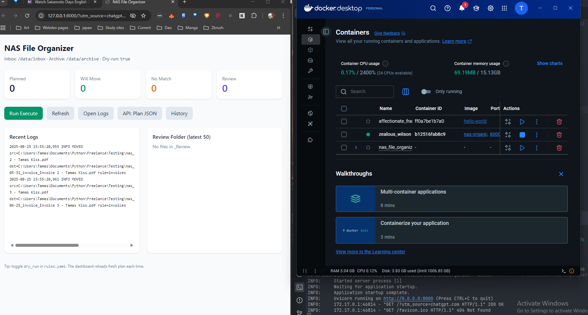

2025-08-29 — Phase 3 Completed: Web UI + Docker Stability

Technical milestones

- Added **Web UI** (FastAPI + Jinja2) → functional at http://localhost:8000.
- Fixed **Docker volume mounts** → Inbox/Archive now properly mapped and visible.
- Solved **cache.db issue** → ensured it’s a file not a folder, persistent across runs.
- Implemented **cross-device safe moves** → copy+delete fallback for Docker-mounted volumes.
- Confirmed **end-to-end run inside Docker** with Web UI trigger.

Reflections

- The containerized environment exposed edge cases (EXDEV errors, bind mounts) that don’t appear locally. Fixing them made the project truly NAS-ready.
- Seeing the Web UI run and files correctly sort inside Docker feels like crossing the threshold: the tool is no longer just a script — it’s an app.
- I’m starting to think of portfolio projects as “depth multipliers” — each phase adds another layer of real-world readiness. With AI’s help, that depth comes faster, but not free: the integration/debugging loop is still human-led.

2025-08-25 - Docker First Run

2025-08-25 — 12-Hour Sprint, AI as Depth Multiplier

Today was a breakthrough day, both technically and mentally.

Technical milestones

- Completed MVP → working file classifier with rules.yaml + OCR.

- Integrated Tesseract (OCR).

- Refined scoring (title/body weighting).

- Added Review folder for ambiguous matches.

- Implemented SQLite cache → massive performance boost on reruns.

- Added structured logging (MOVED/REVIEW/SKIP/ERROR).

- Started proper project hygiene: CHANGELOG.md + this JOURNAL.md.

What would normally take days or weeks came together in ~12 hours.

Reflections

- Even with AI generating the bulk of code, the process still required hours of integration, debugging, testing, decision-making. AI doesn’t replace the human role — it accelerates it.

- The shift today was realizing my value isn’t in typing every line, but in directing, shaping, and steering. Typing is cheap; decisions and design are not.

- AI compresses timelines. A “2-week scope” can shrink to 2 days. But instead of stopping early, this unlocks time for advanced features that would have normally taken months. In other words: AI doesn’t make projects shallower — it makes them potentially deeper.

- The fear that “AI takes jobs” is misplaced. What it really does is increase data and decision points, requiring humans even more to define direction, resolve conflicts, and determine what matters.

**Tags:** #AI #Automation #OCR #NAS #Python #SQLite #Productivity #AIWorkflow #Reflection
