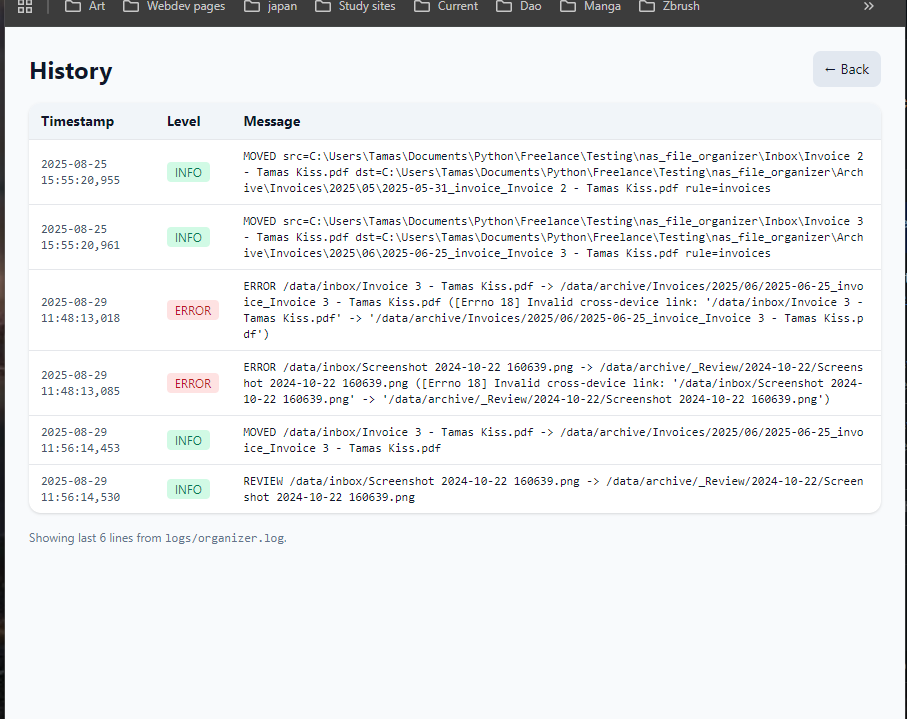

2025-08-31 — Phase 4: Retrain Loop Completed

Technical milestones
- Integrated `ml/train.py` with Review UI → retrain button works, saves `model.pkl`.
- Trainer collects samples from `ml_labels` (human gold) + archive paths for backfill.
- Fixed stratified split crash by adding robust fallback for single-class training.
- Confirm/Save action now *moves* files from `_Review` to the chosen label folder and updates DB paths.
- Verified full loop: classify → review → retrain → re-classify.

Reflections
- Early ML runs showed 0 confident matches — expected with tiny training sets.
- The “aha” was seeing retrain succeed (200 OK) and produce a model artifact.
- This phase made clear: feedback is the engine. Without corrections, the model has nothing to learn.
- Feels like a true self-learning system now — not just rules, not just a static model, but a live loop.

Next
- Expose metrics (accuracy, per-class counts) in UI after retrain.
- Add `nas-train` CLI for scheduled retraining (cron job).
- Scale dataset (seed via backfill + more manual review).

2025-08-31 — Phase 4: Review UI alive + label creation

Technical milestones
- Shipped **Review UI** with per-row Approve/Save and **Bulk assign**.
- Added **Create New Label** (POST `/review/labels/new`) — creates archive folder and returns to Review.
- Logged ML predictions into `ml_samples` during planning so Review always has items.
- Fixed route registration by hot-patching the endpoint in `web.py` (container wasn’t reloading router code).
- Cleaned up template forms (no nesting), added Tailwind header and “select all” + counter.

Reflections
- The bug wasn’t logic; it was **environment**: Python edits in the router weren’t reflected in the running container. A tiny hotfix in `web.py` unblocked the feature immediately.
- “Explicit is better than implicit” hit hard today: naming routes + hardcoding the POST path (`/review/labels/new`) avoided the prefix confusion.
- Progress feels nonlinear: one missing route masked multiple UI tweaks. Once the endpoint existed, the whole Review loop clicked.
- Next time: mount source in compose (dev mode) so Python changes are live, or rebuild consistently after code edits.

Next
- Update trainer to **prefer human gold** from `ml_labels` and log metrics after retrain.
- Add `nas-train` CLI + weekly example, then iterate on thresholds with a slightly larger dataset.

2025-08-29 — Phase 3 Completed: Web UI + Docker Stability

Technical milestones

- Added **Web UI** (FastAPI + Jinja2) → functional at http://localhost:8000.
- Fixed **Docker volume mounts** → Inbox/Archive now properly mapped and visible.
- Solved **cache.db issue** → ensured it’s a file not a folder, persistent across runs.
- Implemented **cross-device safe moves** → copy+delete fallback for Docker-mounted volumes.
- Confirmed **end-to-end run inside Docker** with Web UI trigger.

Reflections

- The containerized environment exposed edge cases (EXDEV errors, bind mounts) that don’t appear locally. Fixing them made the project truly NAS-ready.
- Seeing the Web UI run and files correctly sort inside Docker feels like crossing the threshold: the tool is no longer just a script — it’s an app.
- I’m starting to think of portfolio projects as “depth multipliers” — each phase adds another layer of real-world readiness. With AI’s help, that depth comes faster, but not free: the integration/debugging loop is still human-led.

2025-08-25 - Docker First Run

 

2025-08-25 — 12-Hour Sprint, AI as Depth Multiplier

Today was a breakthrough day, both technically and mentally.

Technical milestones

- Completed MVP → working file classifier with rules.yaml + OCR.

- Integrated Tesseract (OCR).

- Refined scoring (title/body weighting).

- Added Review folder for ambiguous matches.

- Implemented SQLite cache → massive performance boost on reruns.

- Added structured logging (MOVED/REVIEW/SKIP/ERROR).

- Started proper project hygiene: CHANGELOG.md + this JOURNAL.md.

What would normally take days or weeks came together in ~12 hours.

Reflections

- Even with AI generating the bulk of code, the process still required hours of integration, debugging, testing, decision-making. AI doesn’t replace the human role — it accelerates it.

- The shift today was realizing my value isn’t in typing every line, but in directing, shaping, and steering. Typing is cheap; decisions and design are not.

- AI compresses timelines. A “2-week scope” can shrink to 2 days. But instead of stopping early, this unlocks time for advanced features that would have normally taken months. In other words: AI doesn’t make projects shallower — it makes them potentially deeper.

- The fear that “AI takes jobs” is misplaced. What it really does is increase data and decision points, requiring humans even more to define direction, resolve conflicts, and determine what matters.

**Tags:** #AI #Automation #OCR #NAS #Python #SQLite #Productivity #AIWorkflow #Reflection
