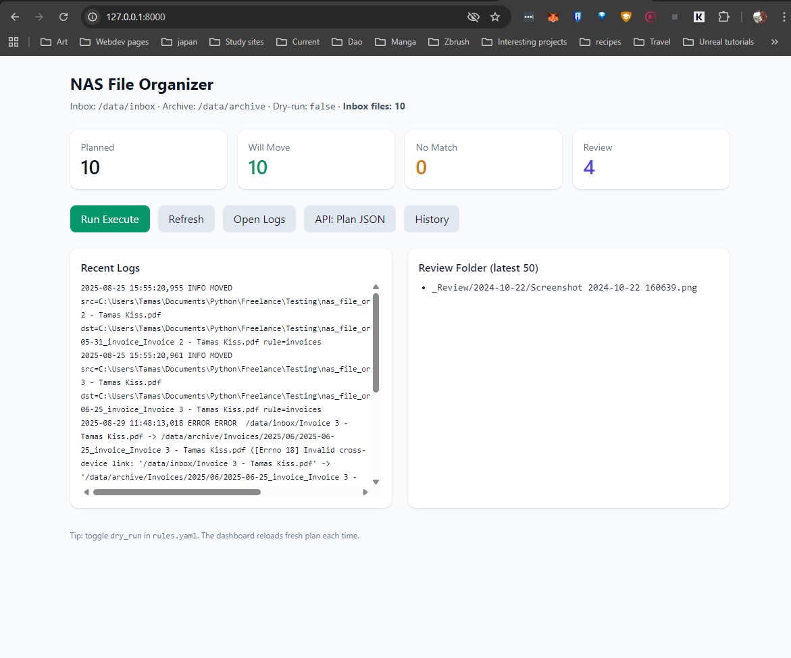
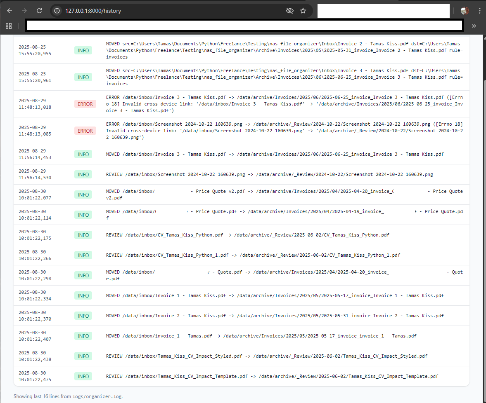
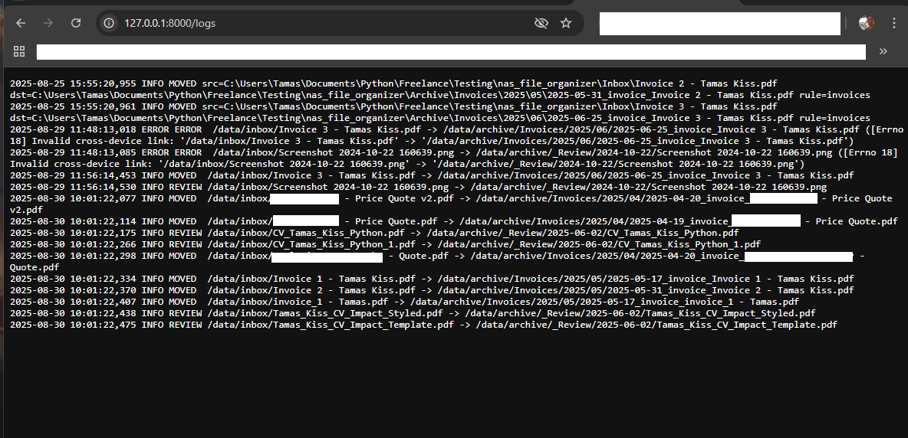

🚀 Smart NAS File Organizer

Self-learning file management for NAS and home servers

🌍 Problem

Messy “Inbox” folders eat up hours. Invoices, contracts, and photos pile up. Rules break on edge cases, and nothing learns from your corrections.

💡 Solution

A self-learning NAS file organizer:

One-line deploy: docker compose up → runs anywhere.

Hybrid rules + ML: rules guarantee safety, ML handles edge cases.

Web dashboard: confirm/correct predictions in seconds.

Continuous learning: retrains weekly from corrections.

Language OCR ready (English).

📊 Impact

80–90% auto-classification after first training.

Human corrections become training data → accuracy climbs over time.

Plug-and-play for freelancers, SMBs, or personal NAS users.

🛠 Tech Stack

FastAPI (backend & web dashboard)

Jinja2 (templates)

Docker (deployment)

SQLite (cache + learning store)

scikit-learn (ML classifier)

Python 3

⚡ Quickstart
1. Clone & build
git clone https://github.com/yourusername/nas-file-organizer.git
cd nas-file-organizer
docker compose up

2. Access the dashboard

Open http://localhost:8000

Upload files into /data/inbox

Classified files move to /data/archive

3. Train the model
docker exec -it nas_file_organizer-nas-organizer-1 \
  python -m app.ml.train \
  --db /data/cache.db \
  --archive-root /data/archive \
  --out /data/model.pkl \
  --version v1

4. Review & correct

Visit /review in the dashboard → confirm/correct classifications.
Corrections feed back into the ML loop automatically.

🗂 Architecture
           ┌──────────┐
           │  Inbox   │
           └────┬─────┘
                │
        ┌───────▼────────┐
        │  Rules Engine  │
        └───────┬────────┘
                │
        ┌───────▼────────┐
        │ Hybrid ML/Rules│
        └───────┬────────┘
                │
        ┌───────▼──────────┐
        │   Archive Store  │
        └───────┬──────────┘
                │
        ┌───────▼──────────┐
        │ Review Dashboard │
        └──────────────────┘

📸 Screenshots / Demo

Web UI home

Example log output

🧭 Roadmap

 Phase 2: SQLite cache + logging + Review folder

 Phase 3: Web UI + Docker stable + cross-device moves

 Phase 4: ML hybrid classifier + feedback loop

 Stretch: multi-language OCR, invoice entity extraction, “ruleless” high-confidence mode
📜 License

This project is licensed under the Prosperity License.

✅ Free for personal, educational, and non-commercial use.

❌ Commercial use requires a license.

See LICENSE.md
 for details.

## 📚 Documentation Map

This repo includes multiple perspectives on the project:

- **README.md** → SaaS-style overview (problem → solution → impact).  
- **CHANGELOG.md** → structured technical history.  
- **JOURNAL.md** → personal dev reflections and process notes.  
- **case_study.md** → portfolio narrative, lessons learned, and impact.

📦 Latest Update (2025-09-01)

Phase 4 complete → closed-loop + auto scheduler

- Review → confirm/correct items move out of `_Review` into labeled folders
- Retrain button trains TF-IDF + Logistic Regression model → model.pkl
- Trainer robust to small datasets (handles single-class gracefully)
- Auto-retrain:
  - Retrains weekly at user-chosen schedule (via `/settings/schedule`)
  - Retrains on startup if model is stale (>7 days)
- Review page now links directly to schedule settings
- All custom routes consolidated in `web.py` (no more 404s)