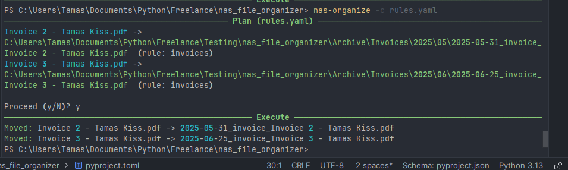

🗂️ NAS File Organizer

Smart document organizer for NAS or local file systems.
Automatically sorts PDFs, images, text, and Office files into the right folders using OCR (Tesseract) and rule-based classification.

✨ Features
✅ Phase 1 — MVP

Rule-based classification via rules.yaml.

Extract text from PDFs, images, DOCX, XLSX, TXT.

OCR support with Tesseract.

CLI command: nas-organize.

Watch mode: nas-watch.

🚀 Phase 2 — Advanced (in progress)

Scoring engine with title/body weighting.

Review folder for ambiguous matches.

SQLite cache → skips repeated OCR/extraction for unchanged files.

Structured logging → logs/organizer.log with MOVED, REVIEW, SKIP, ERROR.

Docker support → ready to run on Synology/QNAP or locally.

➡️ Next: add lightweight Web UI for monitoring, reviewing, and rule tweaking.

📦 Installation

Clone and install in editable mode:

git clone https://github.com/ThomasKaen/nas_file_organizer.git
cd nas_file_organizer
pip install -e .

Requires:

Python 3.13+

Tesseract OCR installed (tesseract --version to check)

⚙️ Usage
Batch mode
nas-organize -c rules.yaml --execute

Watch mode
nas-watch

Debugging (see scores)
nas-organize -c rules.yaml --trace

🐳 Docker

Build and run:

docker build -t nas-organizer .
docker run --rm ^
  -v ${PWD}/rules.yaml:/app/rules.yaml ^
  -v "C:\Users\User\Documents\Inbox":/data/inbox ^
  -v "C:\Users\User\Documents\Archive":/data/archive ^
  -v ${PWD}/logs:/app/logs ^
  nas-organizer

For NAS deployment, map shared folders into /data/inbox and /data/archive.

## Milestone: First Successful Run 🎉

On **2025-08-25**, the first test invoices were sorted automatically into archive folders.  

**Demo run:**

As shown above:
- Detected 2 invoices in the inbox
- Classified with the `invoices` rule
- Moved into archive structure `Archive/Invoices/YYYY/MM/`
- Renamed using the template `{date}_{first_keyword}_{original}`
- 
📜 License

This project is licensed under the Prosperity License.

✅ Free for personal, educational, and non-commercial use.

❌ Commercial use requires a license.

See LICENSE.md
 for details.

📝 Project Status

Current phase: 2 (Advanced features done, preparing Web UI)

Next step: Build simple Web dashboard (view logs, review files, tweak rules).

Long-term: Multi-client profiles, DB-backed rule sets, smarter NLP classification.

⚡ Tags: python · tesseract · ocr · nas · file-automation · sqlite · docker · automation · productivity